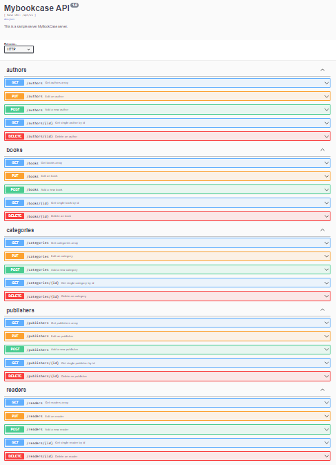

# Go RESTful API with Gin Web Framework & MySQL
This is an example golang backend application using MySQL database with clean architecture.

## Features
* Go Web Framework ([gin-gonic](https://github.com/gin-gonic/gin))
* Swagger ([swaggo](https://github.com/swaggo/swag))
* CRUD operations
* JWT for authentication
* MySQL Driver: [GORM](github.com/jinzhu/gorm)


## Getting Started

```sh
# download the project
git clone https://github.com/aabdullahgungor/mybookcase.git

cd mybookcase
```

### Run the Project

```bash
go run main.go
```
### Access API using 

```bash
http://localhost:9090/api/v1
```

### Sample of Endpoints

- GET localhost:9090/api/v1/books
- GET localhost:9090/api/v1/books/:id
- POST localhost:9090/api/v1/books
- PUT localhost:9090/api/v1/books
- DELETE localhost:9090/api/v1/books/:id
- ........

### Sample API Requests and Responses

#### POST localhost:9090/api/v1/authors
```bash
localhost:9090/api/v1/authors
```
request body:
```bash
{
        "id": 8,
        "name": "Yazar8"
  }
```
response body:
```bash
{
    "author_id": 8,
    "message": "Author has been created"
}
```
#### POST localhost:9090/api/v1/books
```bash
localhost:9090/api/v1/books
```
request body:
```bash
 {
        "id": 8,
        "name": "Kitap8",
        "description": "Aciklama8",
        "published_date": "2020-08-08T00:00:00Z",
        "edition": 8,
        "total_pages": 800,
        "language": "Turkce",
        "isbn": "12345678",
        "image_url": "imageUrl8",
        "author_id": 6,
        "reader_id": 1
    }
```
response body:
```bash
{
    "book_id": 8,
    "message": "Book has been created"
}
```
#### POST localhost:9090/api/v1/categories
```bash
localhost:9090/api/v1/categories
```
request body:
```bash
 {
        "id": 7,
        "category_name": "Kategori7"
    }
```
response body:
```bash
{
    "category_id": 7,
    "message": "Category has been created"
}
```
#### POST localhost:9090/api/v1/publishers
```bash
localhost:9090/api/v1/publishers
```
request body:
```bash
  {
        "id": 7,
        "publisher_name": "Yayinevi7"
    }
```
response body:
```bash
{
    "publisher_id": 7,
    "message": "Publisher has been created"
   
}
```
#### POST localhost:9090/api/v1/readers
```bash
localhost:9090/api/v1/readers
```
request body:
```bash
{
        "id": 3,
        "name": "reader3",
        "email": "reader3@hotmail.com",
        "password": "123456"
    }
```
response body:
```bash
{
    "reader_id": 3,
    "name": "reader3",
    "email": "reader3@hotmail.com",
    "message": "Reader has been created"
}
```

## Open API Doc Preview
http://localhost:9090/api/v1/swagger/index.html


